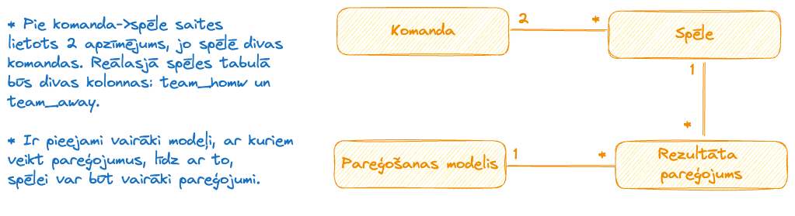

# basketbols-ar-kaju

NBA game outcome prediction.

## Saturs

- [Technology stack](#Technology-stack)
- [Concept](#Concept)
- [Lietotāju stāsti](#Lietotāju-stāsti)

## Tehniskais risinājums

### Frontend

| Satvars | Vue.js |
| ---- | ---- |
| Programmēšanas valoda | Javascript |
| Tīmekļa serveris | Nginx |

Tika pielietota client-side rendering pieeja. Piekļuve datu bāzei notiek caur HTTP pieprasījumiem uz API.

### Backend

| Satvars               | Flask  |
| --------------------- | ------ |
| Programmēšanas valoda | Python |
| Tīmekļas serveris                      | Waitress       |

Pieprasījumu un atbilžu validācijai tiek pielietota Marshmallow bibliotēka.

### Datubāze

Izmantotā datubāze ir Azure SQL server. Tās pamatā ir Microsoft SQL Server, kas izmanto Transact SQL dielektu.

### Izmantotā infrastruktūra

Visi resursi tika izvietoti Azure platformā.
Datu bāze - Azure SQL server
Frontent un Backend - Azure Container App
Failu krātuve - Azure BLOB Storage

## Algoritms

Lai pareģotu basketbola spēles tika izmantota mašīnmācīšanās pieeja.

### Concept

### Lietotāju stāsti

| Apraksts                                                                                                                                                              | Prioritāte (1..10) |
| --------------------------------------------------------------------------------------------------------------------------------------------------------------------- |:------------------:|
| Lietotājam ir iespēja izvēlēties pareģošanas modeli un apskatīt pareģojumu noteiktai spēlei                                                                           |         10         |
| Lietotājam ir iespēja apskatīties tuvākās NBA spēles                                                                                                                  |         8          |
| Gadījumā, ja kāda no spēlēm nav sarakstā, lietotājam ir iespēja piedāvāt trūkstošo spēli. Tiek pārbaudīts, vai tā tiešām ir reāla spēle un tiek pievienota sarakstam. |         6          |
| Lietotājam ir iespēja apskatīt datus par modeli (nosaukums, nominālā precizitāte, pareģošanas vēsture)                                                                |         5          |
| Ar ChatGPT izveidotā reportāža par spēli                                                                                                                              |         3          |
| Pareģošanas modelim ir savs profils ar bildi, vārdu, uzvārdu un statistiku                                                                                            |         4          |

